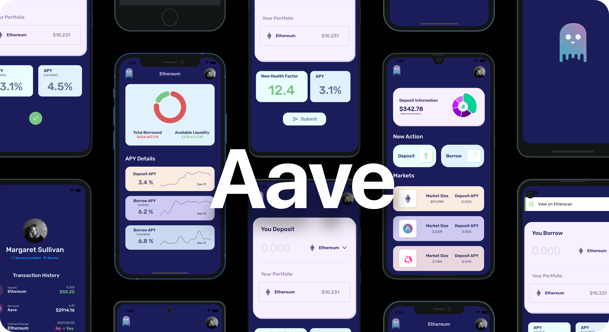

# Aave: UI Mockup with React Native and Expo

 

<!-- 
## Table of Contents
---
- [About](#About)
- [Features](#features)
- [Install & Build](#install--build) -->

## About 

UI mockup of the Ethereum based liquidity protocol, Aave.

## Features

🛠️ Expo SDK 41

🧭 React Navigation V5

💻 Typescript 

💅 Styled-Components

## Install & Build

First, make sure you have Expo CLI installed: `npm install -g expo-cli`

Install: `yarn` or `yarn install`

Run Project Locally: `yarn start` or `expo start`

## Future Plans 
- Connect to [The Graph](https://thegraph.com/) to add realtime data
- Add functionality from [Aave JS](https://github.com/aave/aave-js) to execute transactions on Mainnet. 